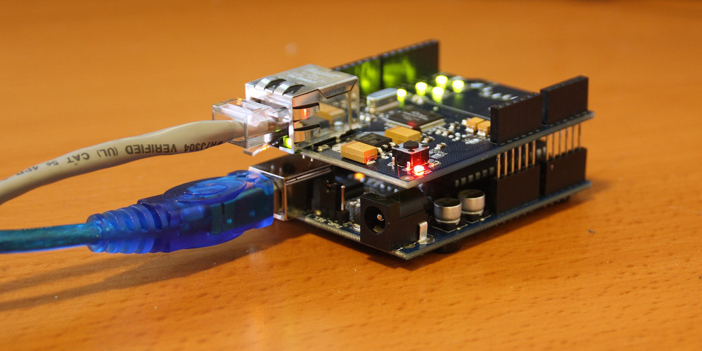
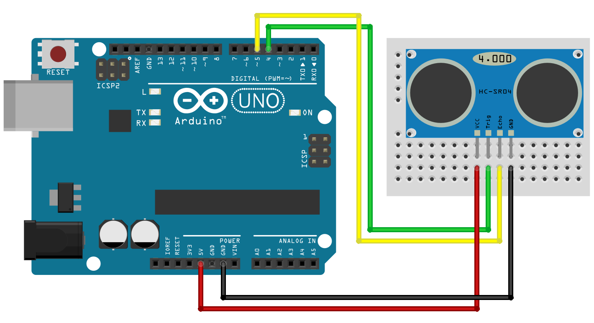

# Arduino to Node.js
# <i class="br br-arduino-notext"></i> ⬌ <i class="br br-nodejs"></i> &nbsp;

_Sending messages from [Arduino][ino] board to a [Node.js][node] application._

<small>Version 0.1.0</small>

[ino]: http://arduino.cc/
[node]: https://nodejs.org/

====

<!-- .slide: class="half-slide" data-background="url(img/paulodiovani.jpg)" data-background-size="contain" data-background-repeat="no-repeat" data-background-position="right" -->

### <i class="fa fa-user"></i> Paulo Diovani Gonçalves

Technologist in Internet Systems by Feevale University.
Software Enginer at Codeminer 42.
GNU/Linux user since 2005.

[blog.diovani.com][blog]

[slides.diovani.com][slides]

[@paulodiovani][twitter]

[![codeminer42][code-logo]][code-site] <!-- .element: class="no-border no-background" -->

[avatar]: img/avatar.jpg
[blog]: http://blog.diovani.com
[slides]: http://slides.diovani.com
[twitter]: http://twitter.com/paulodiovani
[code-logo]: img/codeminer42.png
[code-site]: http://codeminer42.com/

====

# <i class="br br-codeminer" style="font-size: 3em;"></i>

**we're hiring**<br>
[become@codeminer42.com](mailto:become@codeminer42.com)

----
<!-- .slide: data-background="linear-gradient(rgba(255, 255, 255, 0.65), rgba(255, 255, 255, 0.65)), url(img/lazy-parking.jpg)" data-background-size="cover" -->

A proof of concept for...

# <i class="fa fa-map-marker"></i> <i class="fa fa-car"></i>
## Lazy Parking

_Internet Systems Technology &ndash;
[Feevale University](http://feevale.br)_<br>
_Interdisciplinary Project I &ndash; 2015_

====
<!-- .slide: data-background="linear-gradient(rgba(255, 255, 255, 0.65), rgba(255, 255, 255, 0.65)), url(img/johnny-five.jpg)" data-background-size="cover" -->

# <i class="br br-johnny-five"></i>

### We're not talking about Johnny-Five. Sorry.

But worth take a look at [johnny-five.io](http://johnny-five.io/).

Note:
Johnny-Five is a Node.js Library used for
prototyping with many different board.

----

## Writing Arduino code

The arduino _sketch_ structure.

```c++
void setup()
{
    // Called when a sketch starts
    // Use it to initialize variables, pin modes, etc.
    // Runs once
}

void loop()
{
    // Called just after setup()
    // Use it to actively control the Arduino board.
    // Loops consecutively.
}
```

Note:
Arduino code is based on C++ but with
it's own commands and librearies

====
<!-- .slide: data-background="linear-gradient(rgba(255, 255, 255, 0.65), rgba(255, 255, 255, 0.65)), url(img/arduino-ultrasonic.jpg)" data-background-size="cover" -->

# <i class="fa fa-question-circle-o"></i>

### How to send sensor data to a web server?

We're using a ultrasonic sensor for example,
but could be any sensor. <!-- .element: class="small" -->

- ~~Serial/USB port~~
- TCP Socket

http://blog.filipeflop.com/sensores/sensor-ultrassonico-hc-sr04-ao-arduino.html <!-- .element: class="credits" -->

Note:
For serial/USB port the Arduino must be
physicaly conected to the server.

====
<!-- .slide: data-background="linear-gradient(rgba(255, 255, 255, 0.65), rgba(255, 255, 255, 0.65)), url(img/arduino-ethernet.jpg)" data-background-size="cover" data-background-position="center" -->

## Arduino Ethernet Shield

https://www.arduino.cc/en/Main/ArduinoEthernetShield

- Allow TCP/IP connections
- Can get a DHCP address
- Read/Write to SD Card

http://www.arduino.cc <!-- .element: class="credits" -->

====

### Assembling Ethernet Shield



https://www.flickr.com/photos/bpunkt/3141966707 <!-- .element: class="credits" -->

====

### Assembling Ultrasonic Sensor



http://blog.filipeflop.com/sensores/sensor-ultrassonico-hc-sr04-ao-arduino.html <!-- .element: class="credits" -->

----

## Arduino Sketch

Source code available at GitHub<!-- .element: class="small" -->

[paulodiovani/arduino2node][arduino-repos]&nbsp;/&nbsp;[arduino/distance/distance.ino][arduino-file]

[arduino-repos]: https://github.com/paulodiovani/arduino2node
[arduino-file]: https://github.com/paulodiovani/arduino2node/tree/master/arduino/distance/distance.ino

====

```c++
// file: distance/distance.ino

void setup() {
  Serial.begin(9600);

  // set modes for sensor pins
  pinMode(trigPin, OUTPUT);
  pinMode(echoPin, INPUT);

  Ethernet.begin(mac, ip);
  delay(1000);
  Serial.println("connecting...");

  if (client.connect(server, 4000)) {
    Serial.println("connected");
  } else {
    Serial.println("connection failed");
  }
}
```

Note:
- set sensor pin modes
- connect to server

====

```c++
// file: distance/distance.ino

void loop() {
  long duration, cm;

  //get sensor data
  digitalWrite(trigPin, LOW);
  delayMicroseconds(2);
  digitalWrite(trigPin, HIGH);
  delayMicroseconds(5);
  digitalWrite(trigPin, LOW);

  duration = pulseIn(echoPin, HIGH);
  cm = microsecondsToCentimeters(duration);

  //print to ethernet client
  client.print("{\"distance\":" + String(cm) + ",\"unit\":\"cm\"}");

  delay(1000);
}
```

Note:
- read sensor data
- send data to server

The `microsecondsToCentimeters()` is a simple
function to convert the time value to cm
based on the sound velocity.

----

## Node.js web app

Source code available at GitHub<!-- .element: class="small" -->

[paulodiovani/arduino2node][nodejs-repos]&nbsp;/&nbsp;[nodejs][nodejs-files]

[nodejs-repos]: https://github.com/paulodiovani/arduino2node
[nodejs-files]: https://github.com/paulodiovani/arduino2node/tree/master/nodejs

====

```js
/* file: lib/web_server.js */

/* view engine setup */
app.set('views', Path.join(__dirname, '..', 'views'));
app.set('view engine', 'ejs');

/* static bower dependencies */
app.use(Express.static(Path.join(__dirname, '..', 'bower_components')));

/* routes */
app.get('/', (req, res) => {
  res.render('index');
});
```

Note:
A simple Express.js app with
`socket.io` attached (not shown).

====

```js
/* file: lib/socket_server.js */

let Io; /* Socket.io instance */

const onMsgReceived = (data) => {
  const json = JSON.parse(data.toString());
  Io.emit('arduino:message', json);
};

module.exports = (io) => {
  Io = io;

  return Net.createServer((client) => {
    client.on('data', onMsgReceived);
  });
};
```

Note:
- receives messages from net socket
- send to browser

----

## Front-end code

Source code available at GitHub<!-- .element: class="small" -->

[paulodiovani/arduino2node][browser-repos]&nbsp;/&nbsp;[nodejs/views/index.ejs][browser-code]

[browser-repos]: https://github.com/paulodiovani/arduino2node
[browser-code]: https://github.com/paulodiovani/arduino2node/tree/master/nodejs/views/index.ejs

====

```js
/* file: views/index.ejs */

var socket = io();
var maxDistance = 200;

socket.on('arduino:message', function(data) {
  var log = "received " + JSON.stringify(data)
          + " at " + new Date() + "\n";
  var barWidth = data.distance * 100 / maxDistance;

  $('#sensor-log').prepend(log);

  $('#distance-bar')
    .attr('aria-valuenow', data.distance)
    .css('width', barWidth + '%')
    .html(data.distance + data.unit);
});
```

Note:
- update DOM with `socket.io` events data

----

# Questions?

====

## Bibliografy


====

### Credits

by Paulo Diovani Gonçalves

<small>[paulo@diovani.com]((mailto:paulo@diovani.com)</small>

_powered by: [reveal.js](http://lab.hakim.se/reveal-js/)_

<small>[http://lab.hakim.se/reveal-js/](http://lab.hakim.se/reveal-js/)</small>

<a rel="license" href="http://creativecommons.org/licenses/by-nc-sa/4.0/"></a>
<span xmlns:dct="http://purl.org/dc/terms/" property="dct:title">Docker for Lazy People</span> by <a xmlns:cc="http://creativecommons.org/ns#" href="http://diovani.com" property="cc:attributionName" rel="cc:attributionURL">Paulo Diovani</a> is licensed under a <a rel="license" href="http://creativecommons.org/licenses/by-nc-sa/4.0/">Creative Commons Attribution-NonCommercial-ShareAlike 4.0 International License</a>.
